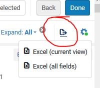
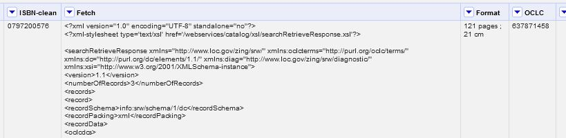

# Using OpenRefine with the WorldCat Search API 
## Table of Contents
* [Description](#description)
* [Instructions](#installation-instructions)
* [License](#license)
* [Questions](#questions)
## Description
This is a variation on the instructions from OCLC posted here: https://www.oclc.org/developer/news/2018/using-oclc-apis-in-open-refine.en.html

The instuctions from OCLC on using the WorldCat Search API in OpenRefine work well. I was using it to get OCLC numbers based on ISBN. Their instructions use this API call:

"http://www.worldcat.org/webservices/catalog/search/sru?wskey={myAPIKey}&query=srw.bn=" 
+ value + "&recordSchema=info%3Asrw%2Fschema%2F1%2Fdc&frbrGrouping=off"

The issue is that this call returns up to 10 records ranked by relevance. For my project, I wanted just 1 record returned and for that record to be the "best" record. Usually in OCLC this is also the record with the most libraries held with English cataloging. 

In order to get just 1 result I added `&maximumRecords=1` to the API call. In order to make sure that record is the one with the most libraries held I added `&sortKeys=librarycount,,0`. This sorts the library count in descending order so the 1 result is the top record.
## Instructions

1. The original spreadsheet is exported from an Alma search result. **In order for OpenRefine to read the spreadsheet, blank columns need to be deleted**.

2. In OpenRefine, Add Columns by Fetching URLs and use this GREL script. I always name this column `Fetch`:

"http://www.worldcat.org/webservices/catalog/search/sru?wskey={myAPIKey}&query=srw.bn=" 
+ value + "&sortKeys=librarycount,,0&maximumRecords=1&recordSchema=info%3Asrw%2Fschema%2F1%2Fdc&frbrGrouping=off"

3. In order to get the OCLC number from the Fetch I added a column based on this column with this GREL:

`join(uniques(forEach(value.split("<oclcdcs>"), v, v.partition("<oclcterms:recordIdentifier>")[2].partition("</oclcterms:recordIdentifier>")[0])), ",")`

4. I wanted the format to make sure the record was print. I added a column based on this column with this GREL:

`join(uniques(forEach(value.split("<oclcdcs>"), v, v.partition("<dc:format>")[2].partition("</dc:format>")[0])), ",")`

5. Finally, I wanted to see the title by adding column based on Fetch using this GREL:

`join(uniques(forEach(value.split("<oclcdcs>"), v, v.partition("<dc:title>")[2].partition("</dc:title>")[0])), ",")`

These columns in Refine should look like this:

6. An extracted script is available in the main directory of this repository: `extractedScript.txt`

## License
ISC. Copyright (c) 2022 Jamie Carlstone
## Questions
* https://github.com/jdcar